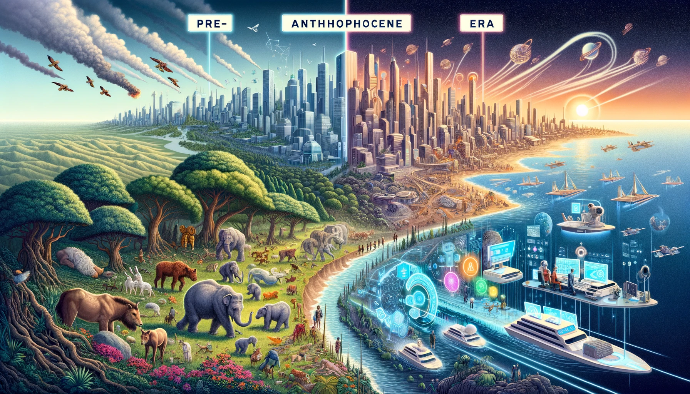

```
1. Physical vs. Meta/Genres
                           \
 3. Epistemology/Modes ->  2. Identity/History -> 5. Time/Voicing -> 6. Change/Pocket
                           /
                            4. Ontology/Qualities
```

1. Genres
2. History
3. Modes
4. History
5. Qualities
   - Physical vs. Meta
     - Data vs. Credo
   - Identity
   - Epistemology
     - Fine-tune:: OpenAI, [RLHF](https://en.wikipedia.org/wiki/Reinforcement_learning_from_human_feedback)
     - Not at all as data-intensive as the underlying models
     - `So OpenAI can do this "safely" away from Microsoft`
   - Ontology
   - [Time](https://github.com/abikesa/openai/blob/main/anthropocene.png)[/](https://www.youtube.com/watch?v=tY6Y4YjinDg)[Scale](https://www.youtube.com/watch?v=L_Guz73e6fw)[/](https://www.youtube.com/watch?v=NjpNG0CJRMM)[Power](https://www.youtube.com/watch?v=U9mJuUkhUzk)
     - Microsoft's Azure
   - Change
6. Pocket
   
```
             1. Antiquarian/Jobs/Tension
                                        \
     3. Monumental/Altman/Integument ->  2. History/Body/Catecholamines -> 5. Uses-Abuses/Mind/Acetylcholine -> 6. Growth-Leadership/Soul/γ-Aminobutyric acid
                                        /
                                         4. Critical/Board/Release
```
   
   gradual iterative development of `agents`:: [GPTs](https://www.youtube.com/watch?v=U9mJuUkhUzk) (publishable)
   - [Safety](https://www.youtube.com/watch?v=U9mJuUkhUzk) best approached this way
     - Do regulators do the same or they issue monstrous laws to stiffle this sort of free, responsible, iteration?
     - Key argument for essay with Charles
     - The [Board ousted Altman](https://www.wsj.com/tech/sam-altman-departs-open-ai-mira-murati-interim-ceo-41f6d51e) shortly after this
       - One source of tension between Altman and some board members was around whether OpenAI was fully considering the safety implications of the products it has rolled out as part of its rapid expansion of commercial offerings, people familiar with the matter said.
   - Instructions
   - Expanded knowledge
   - ***Actions***
  
   ---

   - Example of GPTs: code.org
   - Middle School: 23/45
   - Video game character picking up coins

```
             1. Notes
                      \
          3. Scale -> 2. Chord -> 5. Rhythm -> 6. Effect
                      /
                       4. Motiv
```

1. Notes:: Alphabet
   - Voir
   - Phonology
   - Harmonic series: `meaning`
   - Even perhaps "the truth"
     
3. Chord:: Modifier
   - Emibala
   - Harmonic painting of mood

5. Scale
   - From perspective of a mode
     
7. Motiv:: Subject
   - Self-contained melodic unit
   - Noun, subject-object
   - Active-passive
   - Foucault is unwittingly incorporated here
     - Not from the `benevolence` of the butcher, brewer, baker that we expect our dinner
     - But from their regard of their self-interest
     - Likewise, it wasn't "for the benefit of humanity" that OpenAI released chatGPT to the world
     - But from their regard of their messianic self-interest of benefiting humanity in their philanthropic arm
     - In the end the power, `pouvoir`, embodied by [Microsoft](https://en.wikipedia.org/wiki/Sam_Altman#Microsoft), proved to be the key determinant.
   - There are implied power structures and hierarchies
   
9. Rhythm:: Verb
   - Activates the noun
   - Time signature
   - Tempo
    
11. Effect
   - Meaning or semantics
   - Phonological + Syntactic: intrinsic
   - Extrinsic
   - Analogy


      ---
     
   - Agent-like experiences
   - Shopify, etc
   - New Assistants API to streamline this

    ---

   - GPTs are precursors to agents who'll be doing tasks for you
   - We believe in gradual iterative development of agents
   - Help you to know what the world is going to be like
  
   ---

   - AI is about individual empowerment
   - Future that we'll architect together
   - Building agents that empower your journey

   ---

   - [Azure credits](https://www.youtube.com/watch?v=U9mJuUkhUzk): 15:00/45:35
   - Work loads
   - Data patterns
   - Infrastructure
     - Power
     - DC
     - Rack
     - Accelerators
     - Shape of Azure post OpenAI models
  
   ---

   - User experience = ethics quite literally; and the individual users in the market place have spoken loudly in response to ChatGPT
   - AI has been here and nothing revolutionary in the models happenned between 11/2022-11/2023; its just the chat interface!
   - This is the spice that hands `agency` to one who has been denied it by forces of history and biology; `empowering`

   
```
1. Hardware, OS, Cloud
                      \
          3. OpenAI -> 2. GPT -> 5. Chat/DALLE/Plugins -> 6. UserExperience
                      /
                       4. API/GUI
```
